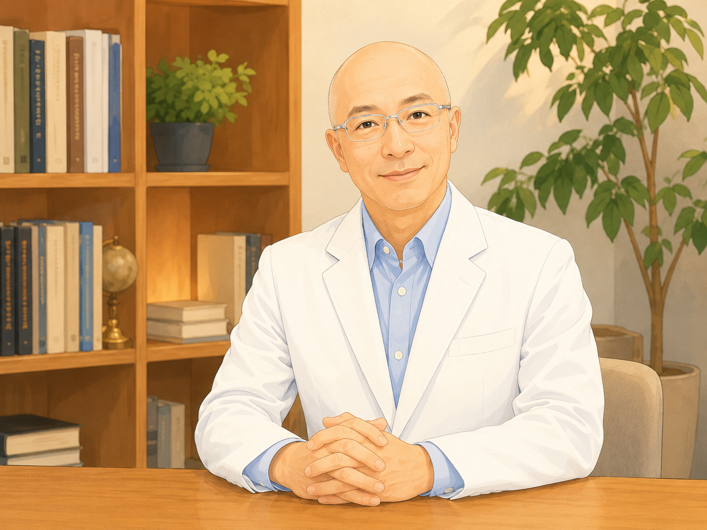
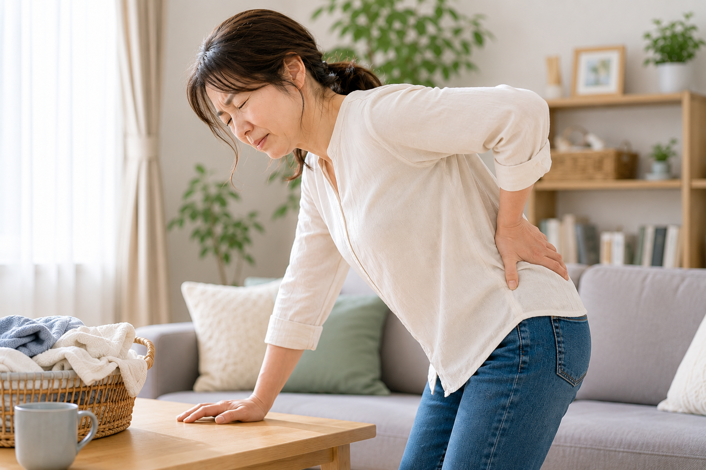

<!DOCTYPE html>
<html lang="ja">
<head>
  <meta charset="UTF-8">
  <meta name="viewport" content="width=device-width, initial-scale=1.0">

  <title>Re:Balance｜介護する人の生活を立て直すオンライン相談｜初回30分無料</title>
  <meta
    name="description"
    content="Re:Balanceは、介護する人が介護を続けながら自分の生活も守れるよう、仕事・家事・休息・身体の負担を一緒に見直し、生活を立て直すためのオンライン相談サービスです。理学療法士・保健医療学博士の有本くにひろが相談を担当します。"
  >

  <link rel="icon" type="image/png" href="favicon.png">

  
</head>

<body>
  <header>
    

      <a href="#" class="brand">
        Re:Balance
        ー介護者サポートー
      </a>

      <nav class="nav-links" aria-label="メインナビゲーション">
        <a href="#problem">お悩み</a>
        <a href="#gain">相談内容</a>
        <a href="#cases">相談例</a>
        <a href="#service">サービス・料金</a>
        <a href="#profile">プロフィール</a>
        <a href="#faq">FAQ</a>
        <a href="#contact">申し込み</a>
        <a
          class="nav-cta"
          href="https://forms.gle/f9Ps6GVnfz3L6eC47"
          target="_blank"
          rel="noopener"
        >
          初回30分無料で相談してみる
        </a>
      </nav>
    

  </header>

  <main>
    <section class="hero">
      

        

          

            

              
Re:Balance

              
ー 介護者サポート ー

            

            
初回オンライン相談 30分無料

            <h1>
              介護を続けながら、 
              自分の生活も守るために。
            </h1>

            

              家族の介護が始まると、仕事、家事、休息、自分の時間まで、 
              少しずつ生活のペースが崩れてしまうことがあります。 
              
                介護をひとりで抱え込まないために、家族への頼り方、仕事との両立、休む時間のつくり方に加え、理学療法士の視点から身体の負担を減らす工夫も一緒に考えます。
              
            

            

              <a
                class="btn btn-primary"
                href="https://forms.gle/f9Ps6GVnfz3L6eC47"
                target="_blank"
                rel="noopener"
              >
                初回30分無料で相談してみる
              </a>

              <a class="btn btn-secondary" href="#service">
                料金・サービスを見る
              </a>
            

            

              オンラインで実施します
              主に土日、一部平日夜に対応
            

          

          

            

            

              <strong>有本くにひろ（アリ先生）</strong>
              Re:Balance 代表
              理学療法士・保健医療学博士
              在宅リハビリの経験をもとに、介護する方の生活と身体を支えます。
            

          

        

        

          <h2>介護で、こんな不安や疲れを感じていませんか？</h2>

          

            

              
            

            

              

                
人

                一人で介護を 抱えるのが不安
              

              

                
体

                介護で体の疲れが 続いている
              

              

                
仕

                介護と仕事の 両立に不安がある
              

              

                
休

                自分の時間を取ることに 罪悪感がある
              

            

          

          

            <a
              class="btn btn-primary"
              href="https://forms.gle/f9Ps6GVnfz3L6eC47"
              target="_blank"
              rel="noopener"
            >
              初回30分無料で相談してみる
            </a>
          

        

      

    </section>

    <section id="gain">
      

        

          <h2>相談では、こんなことを一緒に考えます</h2>
          

            今いちばん困っていることから、生活の中で実際に変えられることを一つずつ考えます。
          

        

        

          

            
理学療法士の視点も活かします

            <h3>介護する人の「生活」と「身体」の両方を見ます</h3>
            

              家族への頼り方や仕事との両立だけでなく、介助による腰や肩の負担、
              休み方、姿勢など、身体への負担を減らす工夫も一緒に考えます。
            

          

          

            
          

        

        

          

            

              

                
1

                

                  <strong>家族や介護サービスに頼れることを考える</strong>
                  

                    自分で抱えていることの中から、家族や周囲に任せられること、利用できるサービスを確認します。
                  

                

              

              

                
2

                

                  <strong>介護・仕事・家事の優先順位を考える</strong>
                  

                    「全部やる」前提を見直し、今やること、任せること、後回しにすることを一緒に決めます。
                  

                

              

            

          

          

            

              

                
3

                

                  <strong>休む時間や自分の時間を確保する方法を考える</strong>
                  

                    休息や自分の用事を「時間が余ったら」ではなく、生活の中にどう確保するかを考えます。
                  

                

              

              

                
4

                

                  <strong>理学療法士の視点から、身体の負担を減らす工夫を考える</strong>
                  

                    介助の仕方や姿勢、休み方など、日常生活の中で取り入れられる方法を一緒に考えます。
                  

                

              

            

          

        

        

          <a
            class="btn btn-primary"
            href="https://forms.gle/f9Ps6GVnfz3L6eC47"
            target="_blank"
            rel="noopener"
          >
            初回30分無料で相談してみる
          </a>
        

      

    </section>

    <section id="change">
      

        

        

          <h2>相談すると、こんな変化を目指します</h2>
          

            すべてを一度に変えるのではなく、今の生活でできるところから少しずつ変えていきます。
          

        

        

          

            
一人で抱え込まず、頼れるところを頼れる

            
仕事・家事・介護の優先順位が見える

            
休む時間や自分の時間を確保できる

            
身体の負担に早めに気づき、無理を続ける前に調整できる

            
今、何から始めればよいかが分かる

          

        

      

    </section>

    <section id="cases">
      

        

          <h2>たとえば、こんなご相談</h2>
          

            ご相談内容をイメージしていただくための一例です。
          

        

        

          

            
想定例

            <h3>仕事を続けながら、家族の介護をしている50代の方</h3>
            

              仕事を続けながら母親を介護。休日も家事と介護で終わり、腰痛も続いている。
              「自分がやらなければ」と思い、家族にもなかなか頼れず、自分の時間がほとんど取れない。
            

            

              このような場合、家族に頼れること、介護サービスの活用、仕事との両立、
              休む時間の確保、身体の負担を減らす工夫など、今の生活で変えられるところから一緒に考えます。
            

          

        

        

          ※上記はサービス内容をイメージしていただくための想定例であり、実際のお客様の声・事例ではありません。
        

      

    </section>

    <section id="service">
      

        

          <h2>サービス内容・料金</h2>
          

            初めての方が相談しやすいよう、初回は30分無料でお話を伺います。
          

        

        

          

            
初めての方へ

            <h3>初回オンライン相談</h3>
            

              介護・仕事・家事・休息・身体の負担など、現在の生活状況をお聞きし、
              どこから見直すと負担を減らせそうかを一緒に確認します。
            

            
30分 無料

            

              初めての方向けの導入相談です。
              ご感想をいただいた方は、次回セッションを500円割引でご利用いただけます。
            

            <a
              class="btn btn-primary"
              href="https://forms.gle/f9Ps6GVnfz3L6eC47"
              target="_blank"
              rel="noopener"
              style="width: 100%; margin-top: 16px;"
            >
              初回30分無料で相談してみる
            </a>
          

          

            
2回目以降

            <h3>個別相談</h3>
            

              介護・仕事・家事・休息の優先順位を見直し、
              今の生活の中で実行できる具体的な方法を一緒に考えます。
            

            
60分 12,000円

            

              2回目以降の単発相談料金です。
              主に土日、一部平日夜に対応しています。
            

            <a
              class="btn btn-secondary"
              href="https://b-book.run/@rebalance.selfcare-c18a0996429f807c"
              target="_blank"
              rel="noopener"
              style="width: 100%; margin-top: 16px;"
            >
              2回目以降の予約をする
            </a>
          

        

        

          ※本サービスは相談によるサポートであり、医療行為や診断を行うものではありません。
          必要に応じて、医療機関や地域包括支援センター等の専門機関の利用をご検討ください。
        

      

    </section>

    <section id="flow">
      

        

          <h2>相談の流れ</h2>
          

            初めての方でも安心して相談できるよう、シンプルな流れにしています。
          

        

        

          

            
1

            <strong>フォームからお申し込み</strong>
            

              現在のお悩みや相談したいことをご記入いただきます。
            

          

          

            
2

            <strong>日程調整</strong>
            

              ご都合の良い日時を確認し、オンライン相談をご案内します。
            

          

          

            
3

            <strong>オンライン相談</strong>
            

              今の状況や悩みをお聞きし、一緒に考えます。
            

          

          

            
4

            <strong>行動の具体化</strong>
            

              相談後に何をどう実行するかを、無理のない形で明確にします。
            

          

        

      

    </section>

    <section id="profile">
      

        

          <h2>相談を担当します</h2>
          

            医療・教育・在宅支援の経験を土台に、
            介護を続けながら自分の生活も守れるよう、暮らしの組み直しを一緒に考えます。
          

        

        

          

            
          

          

            

              介護者の心身サポーター
              理学療法士
              保健医療学博士
            

            <h3 style="font-size: 1.9rem; margin-bottom: 8px;">
              有本くにひろ（アリ先生）
            </h3>

            

              Re:Balance 代表
            

            

              理学療法士として在宅リハビリテーションの現場で、
              多くの利用者様とご家族に関わってきました。
              その中で、介護を支える人ほど、自分の心身を後回しにしやすい現実を
              数多く見てきました。
            

            

              理学療法士養成校教員として人材育成に携わり、
              保健医療学博士として専門性を深めてきました。
              現場感のある理解と専門的な視点の両方を活かし、
              介護・仕事・家事・休息・身体の負担を一緒に見直し、
              介護を続けながら自分の生活も守れる形へ立て直すための相談を行っています。
            

            

              <a
                class="btn btn-primary"
                href="https://forms.gle/f9Ps6GVnfz3L6eC47"
                target="_blank"
                rel="noopener"
              >
                初回30分無料で相談してみる
              </a>

              <a
                class="btn btn-secondary"
                href="https://www.instagram.com/arimoto.coach/"
                target="_blank"
                rel="noopener"
              >
                Instagramを見る
              </a>

              <a
                class="btn btn-note"
                href="https://note.com/rebalance_care08"
                target="_blank"
                rel="noopener"
              >
                noteを読む
              </a>
            

            

              初回オンライン相談30分無料／オンライン対応／主に土日対応
            

          

        

      

    </section>

    <section id="faq">
      

        

          <h2>よくあるご質問</h2>
          
初めての方からよくいただくご質問をまとめています。

        

        

          

            <strong>Q. 相談では何を話せばよいですか？</strong>
            

              A. まとまっていなくても大丈夫です。
              今感じていることや困っていることから一緒に考えていきます。
            

          

          

            <strong>Q. 介護のこと以外でも相談できますか？</strong>
            

              A. はい。行動習慣、働き方、人間関係など、
              介護と関連するテーマも含めてご相談いただけます。
            

          

          

            <strong>Q. オンラインが苦手でも大丈夫ですか？</strong>
            

              A. 事前に接続方法をご案内します。
              できるだけ不安なく参加できるよう配慮します。
            

          

          

            <strong>Q. 医療行為や治療相談はできますか？</strong>
            

              A. 本サービスは相談によるサポートであり、
              医療行為や診断を行うものではありません。
              必要に応じて適切な医療機関等の利用をご検討ください。
            

          

          

            <strong>Q. 家族介護を始めたばかりでも相談できますか？</strong>
            

              A. はい。介護が始まったばかりで
              何から考えればよいかわからない方にも対応しています。
            

          

        

      

    </section>

    <section id="contact">
      

        

          

            <h2>介護で崩れた生活のペースを、少しずつ立て直しませんか。</h2>
            

              初回相談は30分無料です。
              介護・仕事・家事・身体の疲れなど、今いちばん困っていることからお聞きします。
            

          

          

            <a
              class="btn btn-primary"
              href="https://forms.gle/f9Ps6GVnfz3L6eC47"
              target="_blank"
              rel="noopener"
            >
              初回30分無料で相談してみる
            </a>

            <a
              class="btn btn-secondary"
              href="https://www.instagram.com/arimoto.coach/"
              target="_blank"
              rel="noopener"
            >
              Instagramを見る
            </a>

            <a
              class="btn btn-note"
              href="https://note.com/rebalance_care08"
              target="_blank"
              rel="noopener"
            >
              noteを読む
            </a>
          

          

            お問い合わせには通常2〜3日以内に返信いたします。
          

        

      

    </section>

    <section id="privacy">
      

        

          

            <h2>プライバシーポリシー</h2>
            

              安心してご相談いただくために、
              個人情報の取り扱いについて明示しています。
            

          

          

            お問い合わせ時にご提供いただいた氏名・メールアドレス・ご相談内容は、
            返信およびサービス提供に必要な範囲でのみ利用します。
          

          

            取得した個人情報は、法令に基づく場合を除き、
            本人の同意なく第三者へ提供しません。
          

          

            個人情報の管理には十分配慮し、安全に取り扱います。
          

          
お問い合わせ：rebalance.selfcare@gmail.com

        

      

    </section>
  </main>

  <footer>
    

      
© Re:Balance

      

        このサイトは、家族を介護している方・介護やリハビリの仕事をしている方向けのオンライン相談サービスの案内ページです。
      

    

  </footer>
</body>
</html>
